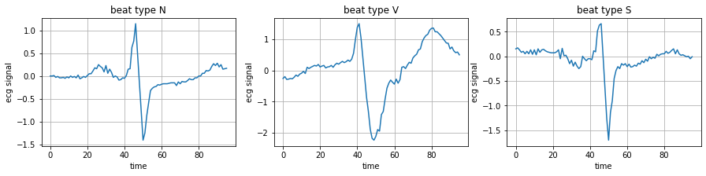
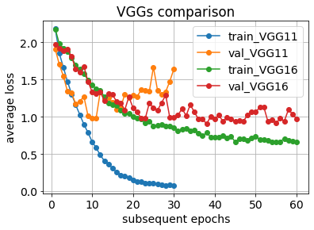

# advanced-machine-learning
notes for Advanced Machine Learning course

[timeline and grading](intro.pdf)

## lecture notes:
- [machine learning fundamentals](ML_fundamentals.pdf)
- [decision trees](Decision_Trees.pdf)
- [deep neural networks](Deep_NNs.pdf)
- [convolutional neural networks](CNNs.pdf)
- computer vision meets deep learning: [part1](CV1.pdf), [part2](CV2.pdf)
- [recurrent neural networks and attention](RNNs.pdf)

## laboratory classes
1. Handwritten digits classification using MNIST dataset with Pytorch
- models: perceptron, deep fully-connected network, generic CNN
- various activations,
- overfitting,
- regularization, early stopping

[Colab notebook](mnist_in_3_flavours.ipynb)

2. ECG signal classification
- classifiers comparison: SVM, decision trees, random forests
- feature vectors

[Colab notebook](ecg_classification.ipynb)

3. Image classification using deep CNNs
- VGG, ResNet

[Colab notebook](advancedCNNs.ipynb)

4. Augmentation in image processing, two separated tasks:
- take MNIST or CIFAR dataset, apply some simple geometric transformations (see e.g. [lecture](CV2.pdf)), and check if such dataset extending improves accuracy (take some CNN model from previous labs)
- play with one-shot style transfer, understand the idea and run some exemplary code
> * papers:
>   * [Gatys original paper](https://www.cv-foundation.org/openaccess/content_cvpr_2016/papers/Gatys_Image_Style_Transfer_CVPR_2016_paper.pdf)
>   * https://arxiv.org/pdf/1904.11617v1.pdf 
> * code:
>   * https://github.com/limingcv/Photorealistic-Style-Transfer 
>   * https://github.com/KushajveerSingh/Photorealistic-Style-Transfer
    
## proposed seminars topics
- [list of proposed topics](seminars_topics.pdf)
- [link to form with seminars dates](https://docs.google.com/spreadsheets/d/17XoAvYHBRc47nQX9PUHcMtEvUUeJ1rTfJIYHQU3FNUA/edit?usp=sharing) 
