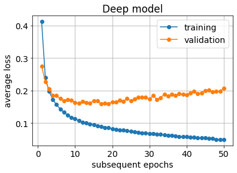

# advanced-machine-learning
notes for Advanced Machine Learning course

[timeline and grading](intro.pdf)

## lecture notes:
- [machine learning fundamentals](ML_fundamentals.pdf)
- [decision trees](Decision_Trees.pdf)

## laboratory classes
1. handwritten digits classification using MNIST dataset with Pytorch
- models: perceptron, deep fully-connected network, generic CNN
- various activations,
- overfitting,
- regularization, early stopping

[Colab notebook](mnist_in_3_flavours.ipynb)

2. ECG signal classification
- feature vectors
- classifiers, decision trees 
3. Image classification using advanced deep NN
- VGG, ResNet
- How NN see the world?
4. Augmentation in image processing
- geometric transformations
- one-shot style transfer

## proposed seminars topics
- [list of proposed topics](seminars_topics.pdf)
- [link to form with seminars dates](https://docs.google.com/spreadsheets/d/17XoAvYHBRc47nQX9PUHcMtEvUUeJ1rTfJIYHQU3FNUA/edit?usp=sharing) 
